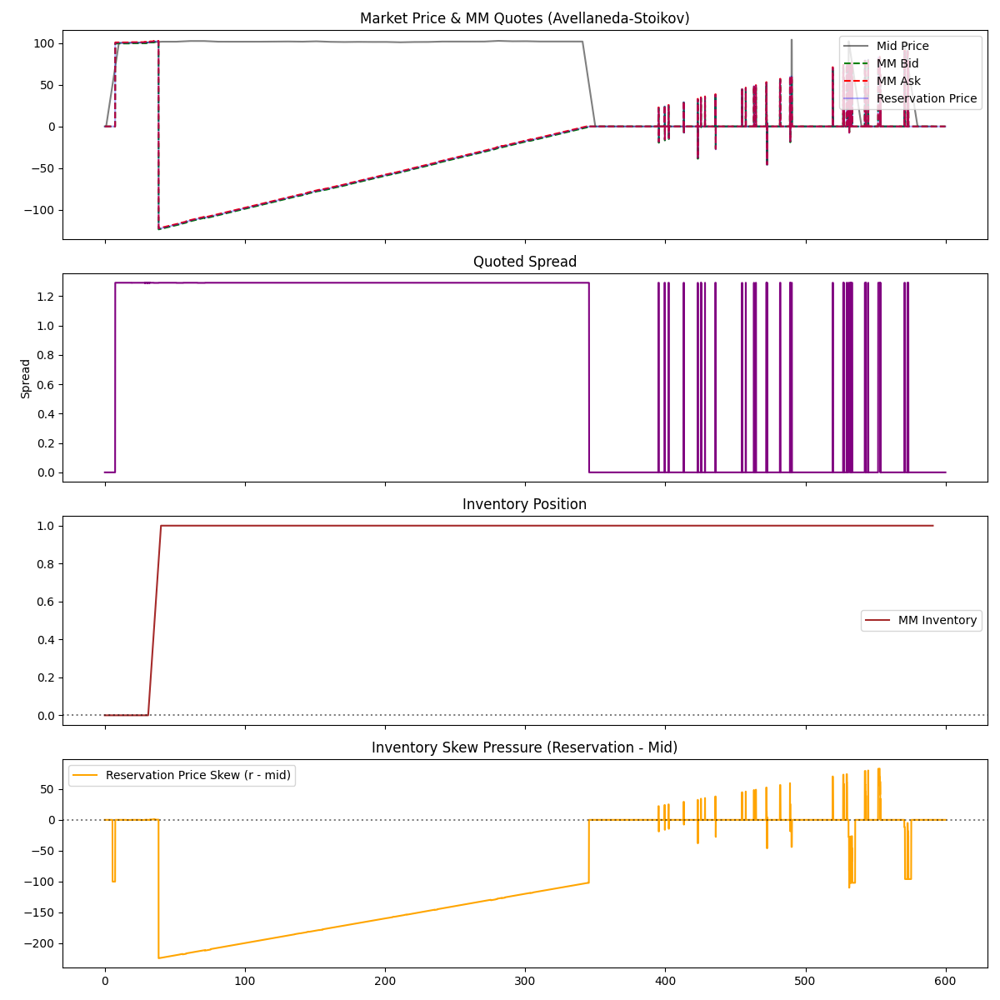

# High-Frequency Limit Order Book Market Maker

A C++ based Limit Order Book (LOB) simulator implementing the **Avellaneda-Stoikov** market-making strategy. This project simulates high-frequency trading dynamics, including Poisson order arrivals, latency, and inventory risk management.



## 📌 Project Objective

Build a full limit order book simulator and implement an optimal market-making strategy from first principles.
The system measures **PnL**, **Inventory Risk**, and **Adverse Selection** under simulated latency.

## 🧠 Core Concepts

- **Market Microstructure**: Price-time priority LOB, matching engine logic.
- **Stochastic Control**: Inventory-dynamic quoting based on Avellaneda-Stoikov (2008).
- **Latency Simulation**: Modeling network and processing delays affecting order placement/cancellation.

## 🧮 Mathematical Model (Avellaneda-Stoikov)

The strategy calculates optimal **Reservation Price** ($r$) and **Spread** ($\delta$) to maximize utility while penalizing inventory variance.

### Reservation Price ($r$)
The price at which the agent is indifferent between buying and selling:
$$r(s, q, t) = s - q \gamma \sigma^2 (T-t)$$

Where:
- $s$: Current Mid Price
- $q$: Current Inventory (positive = long, negative = short)
- $\gamma$: Risk Aversion parameter
- $\sigma$: Market Volatility
- $T-t$: Time remaining in the session

**Intuition**: If the agent is long ($q > 0$), $r < s$, shifting quotes down to encourage selling and discourage buying.

### Optimal Spread ($\delta$)
$$ \delta = \frac{1}{\gamma} \ln(1 + \frac{\gamma}{k}) $$

Where $k$ is the order arrival intensity parameter.

## 🏗️ Project Architecture

```
lob_market_maker/
├── include/              # Header files
│   ├── engine/           # Order, OrderBook, MatchingEngine
│   ├── strategies/       # MarketMaker, AvellanedaStoikov
│   └── simulation/       # MarketSimulator, LatencyModel
├── src/                  # Source files
│   ├── engine/
│   ├── strategies/
│   ├── simulation/
│   └── main.cpp          # Entry point
├── scripts/
│   └── analyze_results.py # Python visualization
└── CMakeLists.txt        # Build configuration
```

## 🚀 How to Run

### Prerequisities
- C++17 compliant compiler (`clang++`, `g++`, or `MSVC`)
- Python 3.x (for analysis)
- `pandas`, `matplotlib`

### 1. Build and Run Simulation
The project does not require complex build tools, but a `CMakeLists.txt` is provided. You can also compile directly:

```bash
# Direct Compilation
clang++ -std=c++17 -Iinclude src/main.cpp src/engine/*.cpp src/strategies/*.cpp src/simulation/*.cpp -o lob_simulation

# Run
./lob_simulation
```

The simulation will run for $T=600$ seconds and generate `trades.csv`, `book.csv`, and `quotes.csv`.

### 2. Analyze Results
Use the provided Python script to visualize performance.

```bash
# Setup Environment (Optional)
python3 -m venv venv
source venv/bin/activate
pip install pandas matplotlib

# Run Analysis
python3 scripts/analyze_results.py
```

This will generate `results.png` showing the price paths, quotes, and inventory skew.

## 🔮 Future Improvements
- Implement a Replay mechanism for historical L3 data.
- Add more complex strategies (Reinforcement Learning).
- optimize `OrderBook` for cache locality (e.g., using vectors instead of maps for levels).

## 📜 License
MIT
